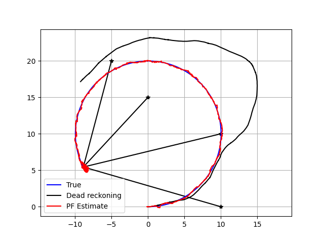

# Monte Carlo Localization (MCL) with Particle Filter for Mobile Robots

This project implements Monte Carlo Localization (MCL), a widely used probabilistic algorithm for estimating a mobile robot's pose (position and orientation) within a known map. Using a particle filter framework, the robot’s state is represented by a set of weighted hypotheses ("particles"), which evolve over time based on motion commands and sensor measurements.

MCL efficiently fuses odometry (dead reckoning) and range measurements to fixed landmarks (e.g., RFID tags) to recursively estimate the robot's pose distribution while handling sensor noise and environmental uncertainties.

# Features

Motion Model: 
- Non-linear robot motion simulated using velocity and yaw rate inputs, incorporating realistic noise.

Sensor Model: 
- Range-only observations to known fixed landmarks with noise, simulating realistic sensor measurements.

Particle Filter: 
- Implements prediction, measurement update (importance weighting), and low-variance resampling to maintain particle diversity.

Covariance Estimation: 
- Computes uncertainty ellipse from particle distribution to visualize pose uncertainty.

Visualization: 
Real-time plotting of:

- True robot path

- Dead reckoning path (odometry-only estimate)

- Particle cloud representing pose hypotheses

- Estimated pose trajectory with covariance ellipse

- Landmarks and sensor range lines

# Dependencies

- Python 3.7+

- NumPy

- Matplotlib

# Background

Monte Carlo Localization (MCL) is an instance of a particle filter tailored for robot localization problems. It represents the robot's belief as a set of weighted particles. Each particle simulates a possible pose hypothesis, which is updated through motion commands and weighted by the likelihood of sensor observations.

This approach handles non-linear robot dynamics and non-Gaussian noise, overcoming limitations of classical filters like the Kalman Filter in complex environments.

# References
- Thrun, S., Burgard, W., & Fox, D. (2005). Probabilistic Robotics. MIT Press.
- Python Robotics https://github.com/AtsushiSakai/PythonRobotics
